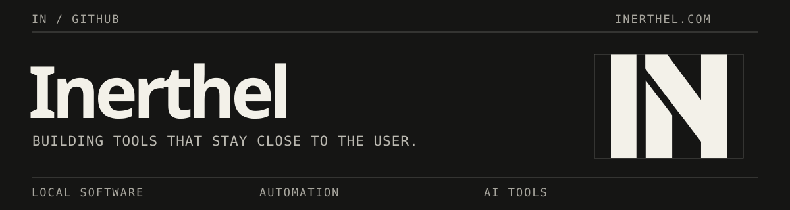

<picture>
  <source media="(max-width: 600px)" srcset="assets/inerthel-banner-mobile.svg" />
  
</picture>

 

<a href="https://inerthel.com">inerthel.com</a> · <a href="mailto:contact@inerthel.com">contact@inerthel.com</a>

# Inerthel

I build local software, automation tools, and applications for AI workflows. My public projects include desktop apps, MCP integrations, and developer tools.

## Selected work

| Project | What it does |
| --- | --- |
| [powerbi-mcp-local](https://github.com/inerthel-agi/powerbi-mcp-local) | Connects MCP clients to Power BI Desktop, Excel, Power Query, and semantic models. |
| [caveman-lang](https://github.com/inerthel-agi/caveman-lang) | Provides compact output rules and skills for AI assistants. |
| [codex-whip](https://github.com/inerthel-agi/codex-whip) | Controls active Codex CLI and Desktop tasks from a Windows overlay. |
| [CodecTone](https://github.com/inerthel-agi/CodecTone) | Converts, compresses, and trims audio locally on Windows. |
| [icue-edge-widgets](https://github.com/inerthel-agi/icue-edge-widgets) | Runs native widgets on Corsair iCUE displays. |
