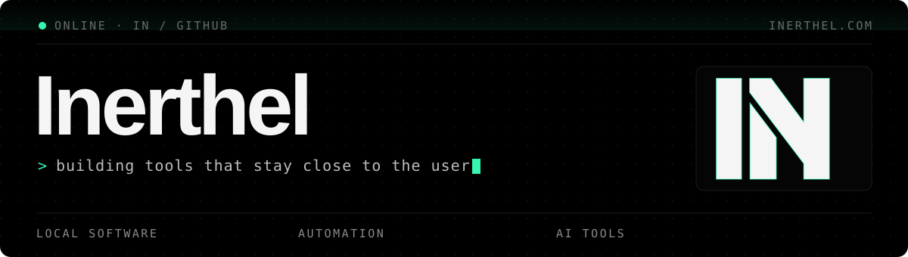
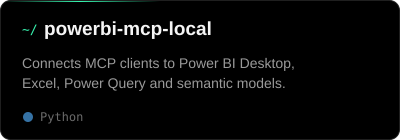
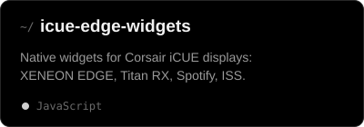
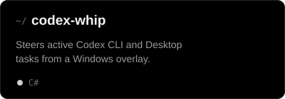
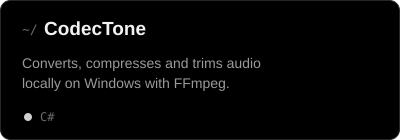
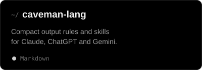

<picture>
  <source media="(max-width: 600px)" srcset="assets/inerthel-banner-mobile.svg" />
  
</picture>

 

<a href="https://inerthel.com">inerthel.com</a> · <a href="mailto:contact@inerthel.com">contact@inerthel.com</a> · <a href="https://x.com/inerthel">X</a> · <a href="https://youtube.com/@inerthel">YouTube</a> · <a href="https://www.tiktok.com/@inerthel">TikTok</a>

 

I build local software, automation tools, and applications for AI workflows. My public projects include desktop apps, MCP integrations, and developer tools.

I no longer type code by hand. I work through agent harnesses, Claude Code and Codex, to move fast. I use Claude Code heavily, mostly with Anthropic's Opus, Fable and Sonnet models. I write the specs; the agents write the code.

As a beginner data analyst, I also build weird things in Power BI and Excel with custom graphical interfaces. With Claude Code, I have already turned an Excel workbook into a playable game. If an idea sounds a bit crazy, I still try it.

**Open to work:** I am looking for a 24-month work-study position (alternance) in Île-de-France, as a data analyst or in other data roles. Reach me at <a href="mailto:pro@chykizona.eu">pro@chykizona.eu</a> or <a href="mailto:contact@inerthel.com">contact@inerthel.com</a>.

 

<table align="center">
  <tr>
    <td></td>
    <td></td>
  </tr>
  <tr>
    <td></td>
    <td></td>
  </tr>
  <tr>
    <td></td>
    <td></td>
  </tr>
</table>

**AI stack:** `Claude Code` · `Codex` · `Opus` · `Fable` · `Sonnet` · `MCP` · `Agent skills`

**Data stack:** `Power BI` · `Excel` · `Power Query` · `DAX` · `SQL` · `Python`

**Interests:** `PC hardware & setup` · `Anime & manga` · `Music: pop, K-pop` · `Video games: FPS, casual & competitive` · `Content creation on Twitch & TikTok`

<b>My setup</b>

| Part | Model |
| --- | --- |
| CPU | AMD Ryzen 7 9800X3D |
| GPU | GIGABYTE GeForce RTX 5070 Ti AERO OC 16G |
| Motherboard | GIGABYTE B650E AORUS STEALTH ICE |
| RAM | Kingston FURY Beast 64 GB (2 × 32 GB) DDR5-6400 MT/s CL32 |
| PSU | ASUS ROG Strix 1000W Platinum White Edition |
| Cooling | CORSAIR iCUE LINK TITAN 360 RX |
| Fans | CORSAIR 12× iCUE LINK RX120 RGB 120 mm |

 

<picture>
  <source media="(prefers-color-scheme: dark)" srcset="https://raw.githubusercontent.com/inerthel-agi/inerthel-agi/output/github-contribution-grid-snake-dark.svg" />
  
</picture>
